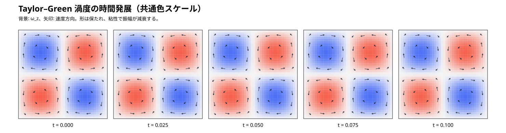
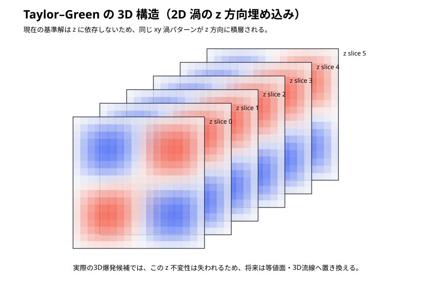

# Taylor–Green 可視化レポート

## 時間発展

5時刻を同じ色スケールで並べ、渦度の減衰を比較します。

## 3D 構造

現在の基準 Taylor–Green は 2D 解を 3D 周期箱へ埋め込んだものなので、`z` 方向には変化しません。下図は同じ `xy` 渦パターンが積層されることを示します。

## ParaView 用データ

`results/reference/taylor_green_reference_n16.vtk` を ParaView で開くと、速度ベクトル `velocity` と渦度 `omega_z` を3次元で確認できます。

この VTK は現在、解析的 Taylor–Green 基準解から生成しています。次段階では FFTW ソルバ本体の実格子 snapshot を同じ形式で出力し、解析解との差も可視化します。
