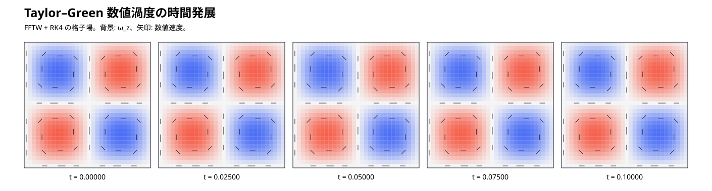
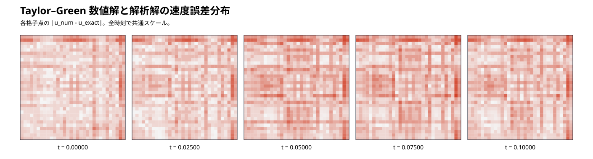
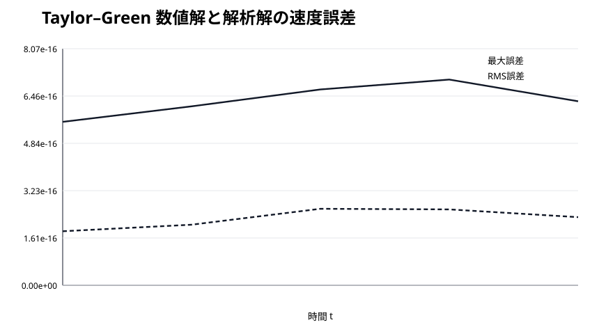

# Taylor–Green 数値流れ可視化レポート

このレポートは解析式だけではなく、FFTW を使った数値時間積分が出力した格子スナップショットから生成しています。

## 数値渦度の時間発展

## 数値解と解析解の速度誤差分布

## 誤差の時間推移

最終スナップショットの最大速度誤差は `6.280e-16`、RMS 速度誤差は `2.326e-16` です。

## 3D 可視化

`results/reference/taylor_green_numerical_n32.vtk` は最終数値格子場を z 方向へ埋め込んだ ParaView 用 VTK です。`velocity`, `omega_z`, `velocity_error` を含みます。

ParaView では Slice / Glyph / Stream Tracer を使うと流れ方向を確認できます。CFD データに対して ParaView は流線や方向付き Glyph を使った可視化をサポートしています。

生データは `results/reference/taylor_green_numerical_snapshots_n32.csv` に保存しています。
