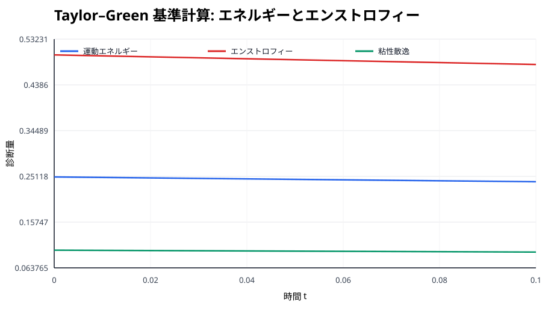
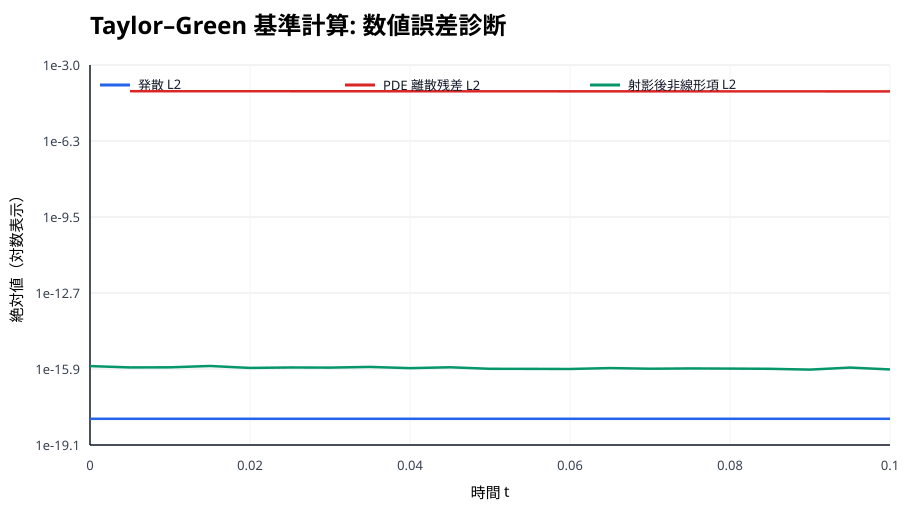
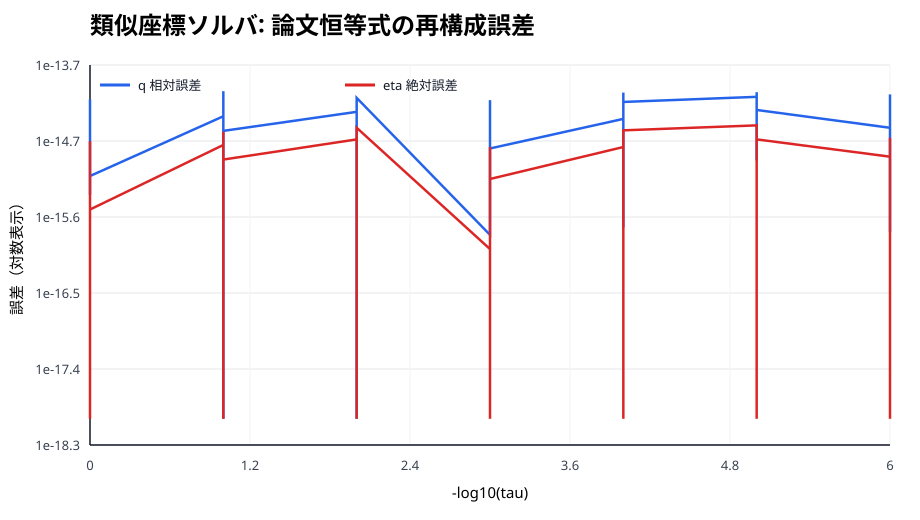
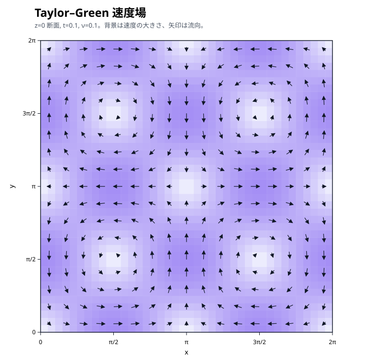
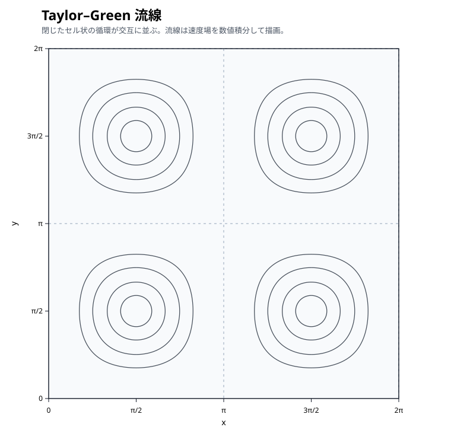
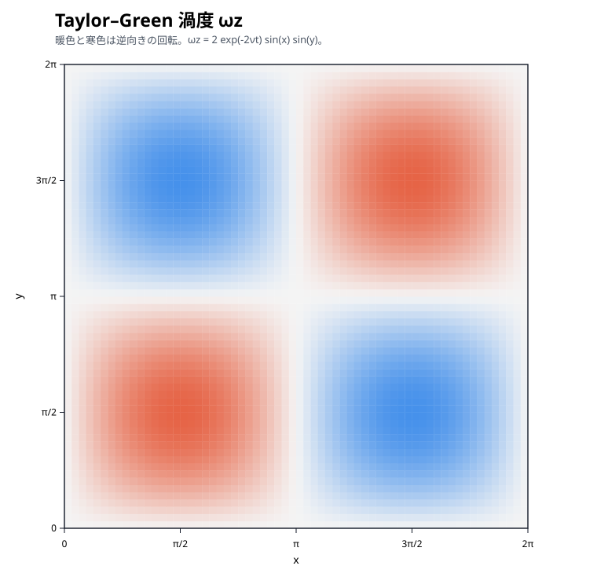

# 最新の自動計算レポート

このレポートは GitHub Actions で自動生成されます。対象コミット: `5791facd89f9`

## 実施した計算・回帰

- FFTW 版 Taylor–Green 基準計算
- 式 (3.2)/(4.1) の類似座標 `q, eta, X`
- Lemma 4.1, 式 (4.2) の `T_b`, `Z_b` と物理座標有限差分
- 式 (4.6)–(4.7) の `A_X`, `V0`, `Pi`
- 式 (4.8)–(4.11) の leading stress `Q_s,N_s,T_0`
- 式 (4.4)–(4.5) の Cartesian 軸正則性
- Fourier 微分・非圧縮射影・2/3 dealiasing・粘性減衰・Taylor–Green 回帰

## Taylor–Green 基準計算の要約

- 最終時刻: `0.1`
- 最終運動エネルギー: `0.240197359788`
- 最終エンストロフィー: `0.480394719576`
- 最大発散誤差 L2: `4.567e-32`
- 最大 CFL: `0.0127324`

## 類似座標ソルバの要約

論文の恒等式

`tau = q (1 - eta^2)`

`z = q^(1/2-h) eta`

を使って既知の `(q, eta)` から `(tau, z)` を作り、数値ソルバで `q` と `eta` を逆算しています。

- 最大 `q` 相対誤差: `8.882e-15`
- 最大 `eta` 絶対誤差: `3.442e-15`

## 現在地

論文固有の類似座標、微分作用素、leading profile の制約式、leading stress、Cartesian 軸正則性までを、exact profile を仮定しない generic numerical kernels と manufactured-profile regression として実装しました。

次の大きな境界は Theorem 4.6 と Appendices A/B の constructive profile `E,U,Pi` です。ここから先は任意の surrogate profile を OpenAI 構成として扱わず、論文の構成手順そのものを段階的に数値化します。その後、active annulus の stress cone と Sections 6–7 の oscillatory wave realization に進みます。

CSV の生データは `results/reference/` に保存されています。実装詳細は `docs/progress.md` と `docs/leading-stress.md` を参照してください。

## Taylor–Green の流れの可視化

基準計算と同じ `t=0.1`, `nu=0.1` の `z=0` 断面を可視化しています。現在の Taylor–Green 回帰は z に依存しない2次元渦を3次元周期箱へ埋め込んだものなので、この断面が全 z で同じ形になります。

### 速度場

背景色は速度の大きさ、矢印は速度ベクトルです。

### 流線

閉じた循環セルが交互に並び、隣接セルでは回転方向が反転します。

### 渦度

`omega_z` の符号で回転方向が分かります。暖色・寒色の4領域が交互に現れます。

