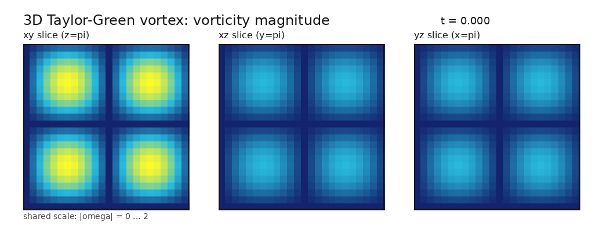
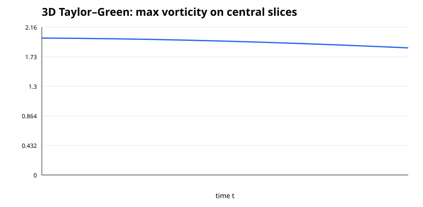

# 3D Taylor–Green 時間発展

標準的な3次元 Taylor–Green 初期条件を FFTW 擬スペクトル法 + RK4 で時間発展させ、中央 `xy / xz / yz` 断面の渦度強度を可視化しています。

## GIF アニメーション

全 11 フレーム、`t=0.000` から `t=0.500` までを共通色スケールで表示します。

## 最大渦度の推移

- 初期中央断面最大渦度: `2`
- 最終中央断面最大渦度: `1.8564219`
- 生データ: `results/reference/taylor_green_3d_snapshots_n24.csv`

この3D Taylor–Greenはソルバ・可視化基盤の検証用です。OpenAI論文の blow-up profile そのものではありません。
